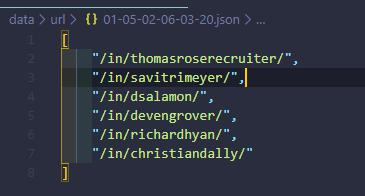
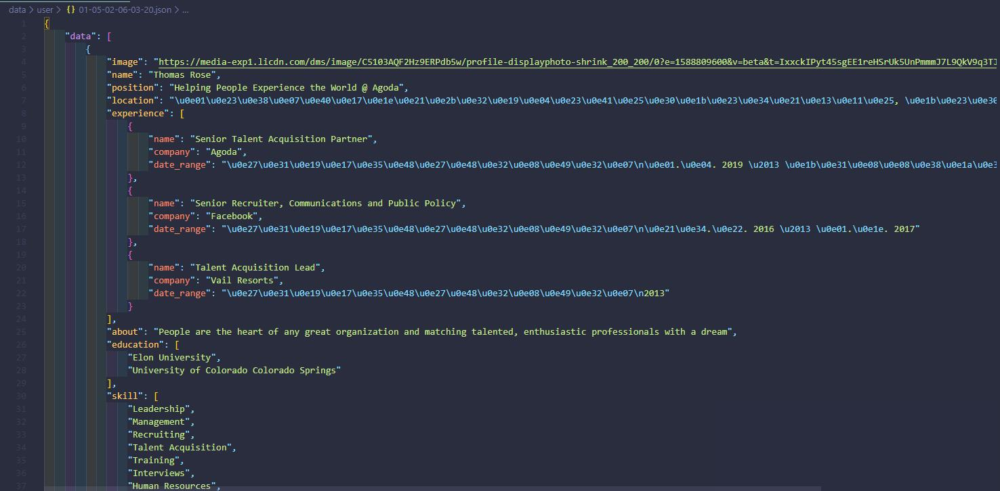

# Linkedin Profile Scraper

Linkedin Profile Scraper use Selenium (automate browser) to extract user url by searching words in the linkedin search system. and used those links to extract each user information thoroughly.


### Tech
* [Python] - base language.
* [Selenium] - library for automates browsers.
* [BeautifulSoup] - library for pulling data out of HTML and XML files.

### Installation

requires [Python 3+](https://www.python.org/downloads/) to run.

Install the dependencies
```sh
$ cd linkedin-profile-scraper
$ pip install -r requirements.txt
```

Config
```sh
$ cd scrap/config.py
- fill your linkedin `username` and `password`
```

Start
```sh
$ cd ..
$ py main.py
- view exmple in main.py     
```

Output
```sh
- data/url: user url list
- data/user: user data
```

Example Output
- User URL


- User Data



License
----

MIT
